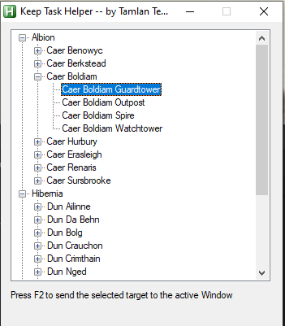

# KeepTaskHelper
A script to help obtain keep tasks on the Brotherlands 2, Dark Age of Camelot Server
To use this script, you must have AHK (https://www.autohotkey.com/) installed.
## Usage:
1. Press F1 to bring up the configuration UI.
2. Select which tower or keep you want to obtain a task for. 
3. Switch back to the game and target a Central Keep Captain (Tower captains will not work)
4. Press F2. 

If successful, the Keep Captain will confirm that you have engaged the task with a dialog message in-game.

